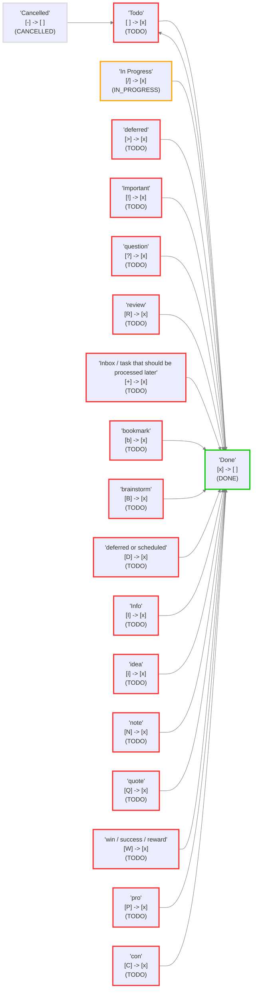

# Review and check your Statuses

## About this file

This file was created by the Obsidian Tasks plugin (version 7.10.0) to help visualise the task statuses in this vault.

If you change the Tasks status settings, you can get an updated report by:

- Going to `Settings` -> `Tasks`.
- Clicking on `Review and check your Statuses`.

You can delete this file any time.

## Status Settings

<!--
Switch to Live Preview or Reading Mode to see the table.
If there are any Markdown formatting characters in status names, such as '*' or '_',
Obsidian may only render the table correctly in Reading Mode.
-->

These are the status values in the Core and Custom statuses sections.

| Status Symbol | Next Status Symbol | Status Name | Status Type | Problems (if any) |
| ----- | ----- | ----- | ----- | ----- |
| `space` | `x` | Todo | `TODO` |  |
| `x` | `space` | Done | `DONE` |  |
| `/` | `x` | In Progress | `IN_PROGRESS` |  |
| `-` | `space` | Cancelled | `CANCELLED` |  |
| `space` | `x` | incomplete | `TODO` | Duplicate symbol '`space`': this status will be ignored. |
| `x` | `space` | complete / done | `DONE` | Duplicate symbol '`x`': this status will be ignored. |
| `-` | `space` | cancelled | `CANCELLED` | Duplicate symbol '`-`': this status will be ignored. |
| `>` | `x` | deferred | `TODO` |  |
| `/` | `x` | in progress, or half-done | `IN_PROGRESS` | Duplicate symbol '`/`': this status will be ignored. |
| `!` | `x` | Important | `TODO` |  |
| `?` | `x` | question | `TODO` |  |
| `R` | `x` | review | `TODO` |  |
| `+` | `x` | Inbox / task that should be processed later | `TODO` |  |
| `b` | `x` | bookmark | `TODO` |  |
| `B` | `x` | brainstorm | `TODO` |  |
| `D` | `x` | deferred or scheduled | `TODO` |  |
| `I` | `x` | Info | `TODO` |  |
| `i` | `x` | idea | `TODO` |  |
| `N` | `x` | note | `TODO` |  |
| `Q` | `x` | quote | `TODO` |  |
| `W` | `x` | win / success / reward | `TODO` |  |
| `P` | `x` | pro | `TODO` |  |
| `C` | `x` | con | `TODO` |  |

## Loaded Settings

<!-- Switch to Live Preview or Reading Mode to see the diagram. -->

These are the settings actually used by Tasks.

